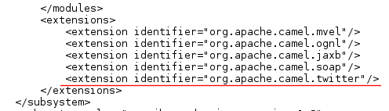

:data-uri:
:toc2:
:rhtlink: link:https://www.redhat.com[Red Hat]
:fswinstall: link:https://access.redhat.com/documentation/en-US/Red_Hat_JBoss_Fuse_Service_Works/6/html-single/Installation_Guide/index.html[FSW install instructions]

image::images/rhheader.png[width=900]

:numbered!:
[abstract]
== JBoss GPE Reference Architecture:  fsw_socialmedia

:numbered:

== Abstract

This reference architecture demonstrates how to pull and process social media feeds in Red Hat Fuse Service Works (FSW) product.

== Overview

A FSW component service is created with a HTTP binding that connects to Twitter and pulls tweets.
The Twitter binding will be similar to the following:

[source]
---------------------------------------------------------------------------------------------------------------
 https://api.twitter.com/1.1/search/tweets.json?since_id=24012619984051000&max_id=250126199840518145&result_type=mixed
---------------------------------------------------------------------------------------------------------------

FSW is started with system properties that define the authorization and security parameters for an OAuth2 connection to Twitter and a keyword to listen for tweets. 
A component service is defined that uses a HTTP binding to connect and pull tweets.
Once the tweets are pulled into FSW, a simple Java bean implementation logs them to stdout.

[red]#TO-DO:  add a UML deployment diagram#

== Pre-Requisites

. Fuse Service Works 6.0.0 environment.
Can either be local ( in which case follow the {fswinstall}) or in an OpenShift PaaS environment (in which case contact the Red Hat's GPE team for assistance).
. git
. maven 3.0.5 (or greater)

== Procedure

=== Twitter account set - up

To be able to poll a twitter account and send updates, the application needs to be registered with a Twitter account. 
This can be done from the http://dev.twitter.com/apps page. 
Be sure to grant read and write rights to the application. 
Make note of the customer key and secret, and the access token key and secret.

=== Clone this project

=== FSW Configuration

. Changes to standalone.xml
+
In $FSW_HOME/standalone/configuration/standalone.xml, add the following line to the section of the switchyard subsystem configuration:
[source]
---------------------------------------------------------------------------------------------------------------
<extension identifier="org.apache.camel.twitter"/>
---------------------------------------------------------------------------------------------------------------

The addition of the twitter extension should be as follows:

. Addition of new JBoss Modules
+
Under $JBOSS_HOME/modules/system/layers/soa/org/apache/camel, create the /twitter/main directory. 
Copy the twitter4j libraries (twitter4j-core-3.0.5.jar and twitter4j-stream-3.0.5.jar) to this directory. 
Also, copy the special build of the camel twitter component (camel-twitter-2.10.0.redhat-60024-1.jar) to this directory and create a module.xml file that looks like:

[source]
---------------------------------------------------------------------------------------------------------------
<module xmlns="urn:jboss:module:1.0" name="org.apache.camel.twitter">
    <resources>
        <resource-root path="camel-twitter-2.10.0.redhat-60024-1.jar"/>
        <resource-root path="twitter4j-core-3.0.5.jar"/>
        <resource-root path="twitter4j-stream-3.0.5.jar"/>
    </resources>

    <dependencies>
        <module name="org.slf4j"/>
        <module name="javax.api"/>
        <module name="org.apache.camel.core"/>
    </dependencies>
</module>
---------------------------------------------------------------------------------------------------------------

. Addition of Java system properties
In order to be able to run this composite, $JBOSS_HOME/bin/standalone.sh with the arguments shown below. 
This script has the additional system properties needed for the correct authorization of the Twitter app as well as the keyword we can going to pull tweets for.

[source]
---------------------------------------------------------------------------------------------------------------
-Dtwitter_keyword="<keyword of interest>" -DconsumerKey="<consumer key from Twitter>" -DconsumerSecret="<consumer secret from Twitter>" -DaccessToken="<Twitter access token>" -DaccessTokenSecret="<Twitter access token secret>"
---------------------------------------------------------------------------------------------------------------

== Build and Deploy _serviceTier_ App
[TO-DO] :  elaborate on _serviceTier_ project:  ie; switchyard xml, add image of application diagram, java classes/interfaces,

=== Validate consumption of social media feeds

If you tail the server.log of your FSW environment, you will see tweets on your subject, like:

[source]
---------------------------------------------------------------------------------------------------------------
14:28:13,980 INFO  [org.jboss.as.server] (DeploymentScanner-threads - 2) JBAS018559: Deployed "fsw_socialmedia_serviceTier.jar" (runtime-name : "fsw_socialmedia_serviceTier.jar")
14:28:15,361 INFO  [stdout] (Camel (camel-13) thread #11 - twitter://search) Tue Jul 01 12:12:33 PDT 2014 (dezateraxeq) #MEXICOvsCROACIA Игра World of Tanks вышла для iPad и iPhone
14:28:15,364 INFO  [stdout] (Camel (camel-13) thread #11 - twitter://search) Tue Jul 01 12:10:00 PDT 2014 (tiethertua77) #MEXICOvsCROACIA Спектакль омского «Арлекина» победил на фестивале в Екатеринбурге
14:28:15,366 INFO  [stdout] (Camel (camel-13) thread #11 - twitter://search) Tue Jul 01 08:58:02 PDT 2014 (carlostoficial) Que es esto? @Td_deportes #mundial #Brasil #mexicovscroacia http://t.co/5Zyak4dCvh
14:28:15,368 INFO  [stdout] (Camel (camel-13) thread #11 - twitter://search) Tue Jul 01 06:32:07 PDT 2014 (jperna_77) “@Hyundai: A little celebration GIF for all you Team Mexico fans. #BecauseFutbol #MEXICOvsCROACIA http://t.co/iMvH7CNuEO” yooooo @2Tbell4 ðð
14:28:15,370 INFO  [stdout] (Camel (camel-13) thread #11 - twitter://search) Tue Jul 01 01:39:11 PDT 2014 (spysreni1976) Назван лучший фильм 36-го Московского Международного кинофестиваля #MEXICOvsCROACIA
14:28:15,372 INFO  [stdout] (Camel (camel-13) thread #11 - twitter://search) Mon Jun 30 14:34:42 PDT 2014 (hectorin226) Que buena foto! #estadiocastelao #Méxicovscroacia #brasil2014 http://t.co/VTwpI0zCfw
14:28:15,374 INFO  [stdout] (Camel (camel-13) thread #11 - twitter://search) Mon Jun 30 11:09:10 PDT 2014 (cycydyxatyp) #MEXICOvsCROACIA К 2018 году рынок игр вырастет до 100 миллиардов долларов
14:28:15,376 INFO  [stdout] (Camel (camel-13) thread #11 - twitter://search) Mon Jun 30 10:41:53 PDT 2014 (fortstarus1991) #MEXICOvsCROACIA Ростелеком выплатит дивиденды за 2013 год на 8.824 млрд руб
---------------------------------------------------------------------------------------------------------------

== Performance Testing
Using the service metrics in the JBoss Management console, a rate of 850 tweets/second was observed.

== To-Do
. Update the OAuth2 parameters to use personal app insteam to camel-tweet
. Add Facebook and Datasift versions of the social media architecture
. After running the test for a certain number of tweets, you will see the Twitter rate-limiting message indicating that has been exceeded. You will have to wait for 40-50 seconds before the rate limit permits more feeds to be pulled into FSW.
=======
