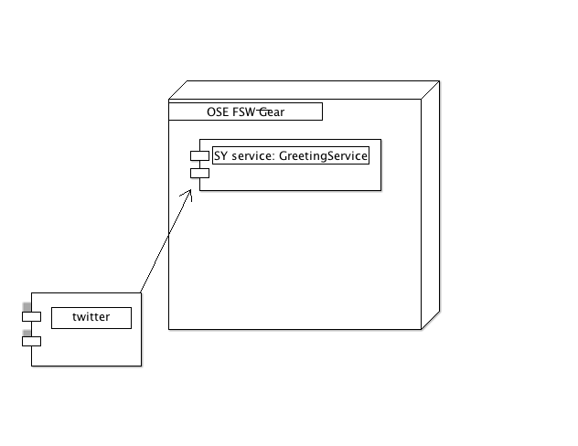
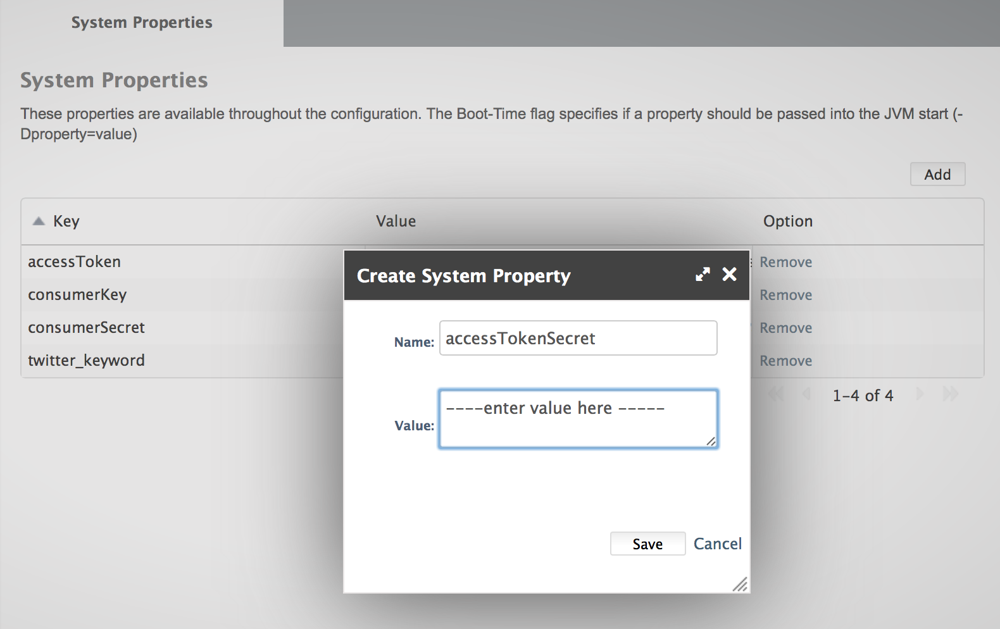
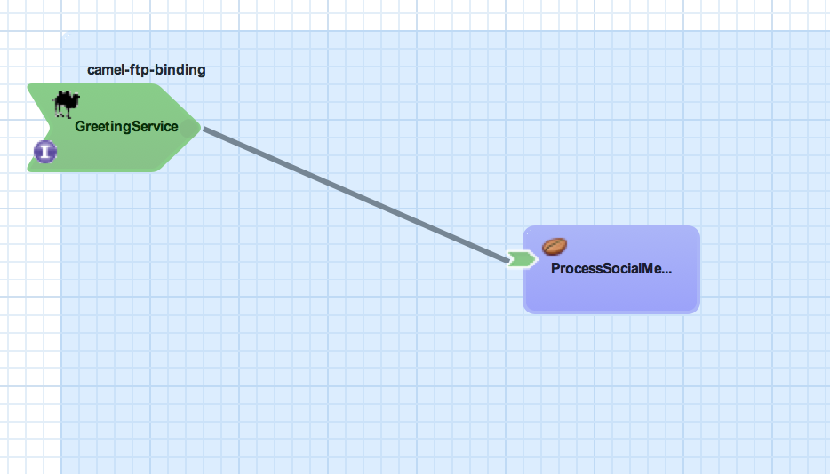
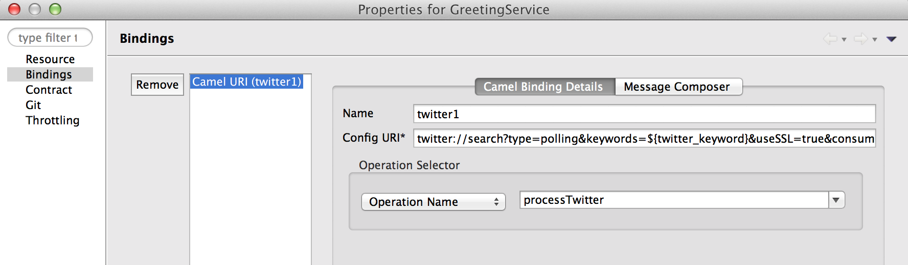
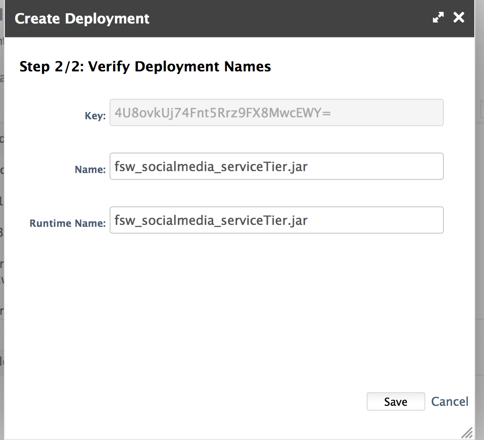
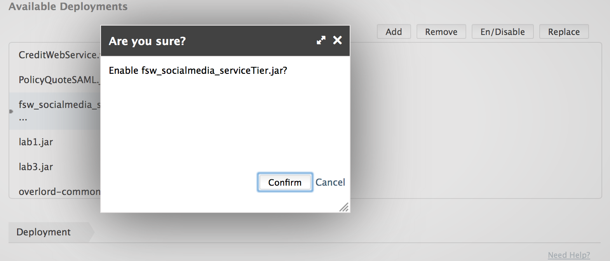

:data-uri:
:toc2:
:rhtlink: link:https://www.redhat.com[Red Hat]
:fswinstall: link:https://access.redhat.com/documentation/en-US/Red_Hat_JBoss_Fuse_Service_Works/6/html-single/Installation_Guide/index.html[FSW install instructions]

image::images/rhheader.png[width=900]

:numbered!:
[abstract]
== JBoss GPE Reference Architecture:  fsw_socialmedia

:numbered:

== Abstract

This reference architecture demonstrates how to pull and process social media feeds in Red Hat Fuse Service Works (FSW) product.

== Overview

A FSW component service is created with a Camel binding that connects to Twitter and pulls tweets.
The Twitter binding will be similar to the following:

[source]
---------------------------------------------------------------------------------------------------------------
twitter://search?type=polling&keywords=${twitter_keyword}&useSSL=true&consumerKey=${consumerKey}&consumerSecret=${consumerSecret}&accessToken=${accessToken}&accessTokenSecret=${accessTokenSecret}
---------------------------------------------------------------------------------------------------------------

FSW is started and configured with system properties that define the authorization and security parameters for an OAuth2 connection to Twitter and a keyword to listen for tweets. 
A component service is defined that uses a Camel binding to connect and pull tweets.
Once the tweets are pulled into FSW, a simple Java bean implementation logs them to stdout.

*UML deployment diagram*

== Pre-Requisites

. Fuse Service Works 6.0.0 environment.
Can either be local ( in which case follow the {fswinstall}) or in an OpenShift PaaS environment (in which case contact Red Hat's GPE team for assistance).
. git
. maven 3.0.5 (or greater)

== Procedure

=== Twitter account set - up

To be able to poll a twitter account and send updates, the application needs to be registered with a Twitter account. 
This can be done from the http://dev.twitter.com/apps page. Click on the Create New App button which takes you the "Create an Application" page. Enter the application details and save. Once the application is created, click on the API Keys tab. Under Application Settings, you will find the consumer key and secret. To obtain the access token and access token secret, click on the Create my Access Token button at the bottom of the page. This will grant the application the necessary privileges and refresh the screen with the token and secret values you need to make a secure connection to Twitter. Make note of the customer key and secret, and the access token key and secret.

=== Clone this project

On your local machine, navigate to your development directory and run:

%git clone https://github.com/jboss-gpe-ref-archs/fsw_socialmedia.git

=== FSW Configuration changes to enable Twitter pulls

==== Changes to standalone.xml

In $FSW_HOME/standalone/configuration/standalone.xml, add the Camel twitter extension id to the section of the switchyard subsystem configuration:
[source]
---------------------------------------------------------------------------------------------------------------
<extension identifier="org.apache.camel.twitter"/>
---------------------------------------------------------------------------------------------------------------

The addition of the twitter extension should be as follows:

image::images/twitter_extension.png[]

==== Addition of new JBoss Modules

Under $JBOSS_HOME/modules/system/layers/soa/org/apache/camel, create the /twitter/main directory. From conf/fsw/modules/system/layers/soa/org/apache/camel/twitter/main/, Copy the twitter4j libraries (twitter4j-core-3.0.5.jar and twitter4j-stream-3.0.5.jar) to this directory. Also, copy the special build of the camel twitter component (camel-twitter-2.10.0.redhat-60024-1.jar) and module.xml to this directory.

==== Addition of Java system properties

Add system properties for the twitter keyword and OAuth2 through JBoss Management Console like:

These additional system properties are needed for the correct authorization of the Twitter app as well as the keyword we can going to pull tweets for.

== Build and Deploy _serviceTier_ App

* serviceTier project:

The following is a diagram of the service composition built for this reference architecture:

We add a Camel binding to the service binding to pull the tweets, that looks like:

The service invoked has a simple bean implementation that outputs the tweet.

* Run %mvn clean install to build the deployment jar. Create a deployment in the JBoss Management Console and deploy it as shown below:

== Validate consumption of social media feeds

If you tail the server.log of your FSW environment, you will see tweets on your subject, like:

[source]
---------------------------------------------------------------------------------------------------------------
14:28:13,980 INFO  [org.jboss.as.server] (DeploymentScanner-threads - 2) JBAS018559: Deployed "fsw_socialmedia_serviceTier.jar" (runtime-name : "fsw_socialmedia_serviceTier.jar")
14:28:15,361 INFO  [stdout] (Camel (camel-13) thread #11 - twitter://search) Tue Jul 01 12:12:33 PDT 2014 (dezateraxeq) #MEXICOvsCROACIA Игра World of Tanks вышла для iPad и iPhone
14:28:15,364 INFO  [stdout] (Camel (camel-13) thread #11 - twitter://search) Tue Jul 01 12:10:00 PDT 2014 (tiethertua77) #MEXICOvsCROACIA Спектакль омского «Арлекина» победил на фестивале в Екатеринбурге
14:28:15,366 INFO  [stdout] (Camel (camel-13) thread #11 - twitter://search) Tue Jul 01 08:58:02 PDT 2014 (carlostoficial) Que es esto? @Td_deportes #mundial #Brasil #mexicovscroacia http://t.co/5Zyak4dCvh
14:28:15,368 INFO  [stdout] (Camel (camel-13) thread #11 - twitter://search) Tue Jul 01 06:32:07 PDT 2014 (jperna_77) “@Hyundai: A little celebration GIF for all you Team Mexico fans. #BecauseFutbol #MEXICOvsCROACIA http://t.co/iMvH7CNuEO” yooooo @2Tbell4 ðð
14:28:15,370 INFO  [stdout] (Camel (camel-13) thread #11 - twitter://search) Tue Jul 01 01:39:11 PDT 2014 (spysreni1976) Назван лучший фильм 36-го Московского Международного кинофестиваля #MEXICOvsCROACIA
14:28:15,372 INFO  [stdout] (Camel (camel-13) thread #11 - twitter://search) Mon Jun 30 14:34:42 PDT 2014 (hectorin226) Que buena foto! #estadiocastelao #Méxicovscroacia #brasil2014 http://t.co/VTwpI0zCfw
14:28:15,374 INFO  [stdout] (Camel (camel-13) thread #11 - twitter://search) Mon Jun 30 11:09:10 PDT 2014 (cycydyxatyp) #MEXICOvsCROACIA К 2018 году рынок игр вырастет до 100 миллиардов долларов
14:28:15,376 INFO  [stdout] (Camel (camel-13) thread #11 - twitter://search) Mon Jun 30 10:41:53 PDT 2014 (fortstarus1991) #MEXICOvsCROACIA Ростелеком выплатит дивиденды за 2013 год на 8.824 млрд руб
---------------------------------------------------------------------------------------------------------------

== Performance Testing
Using the service metrics in the JBoss Management console, a rate of 850 tweets/second was observed.

== To-Do
. Add Facebook and Datasift versions of the social media architecture
. After running the test for a certain number of tweets, you will see the Twitter rate-limiting message indicating that has been exceeded. You will have to wait for 40-50 seconds before the rate limit permits more feeds to be pulled into FSW.
. Persist twitter/facebook feeds in Elastic Search
=======
